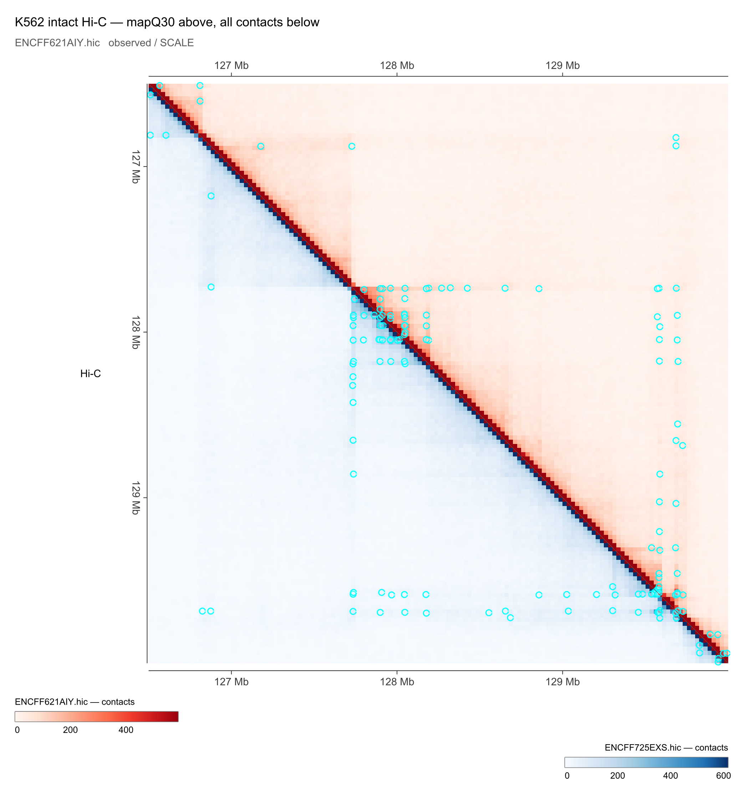
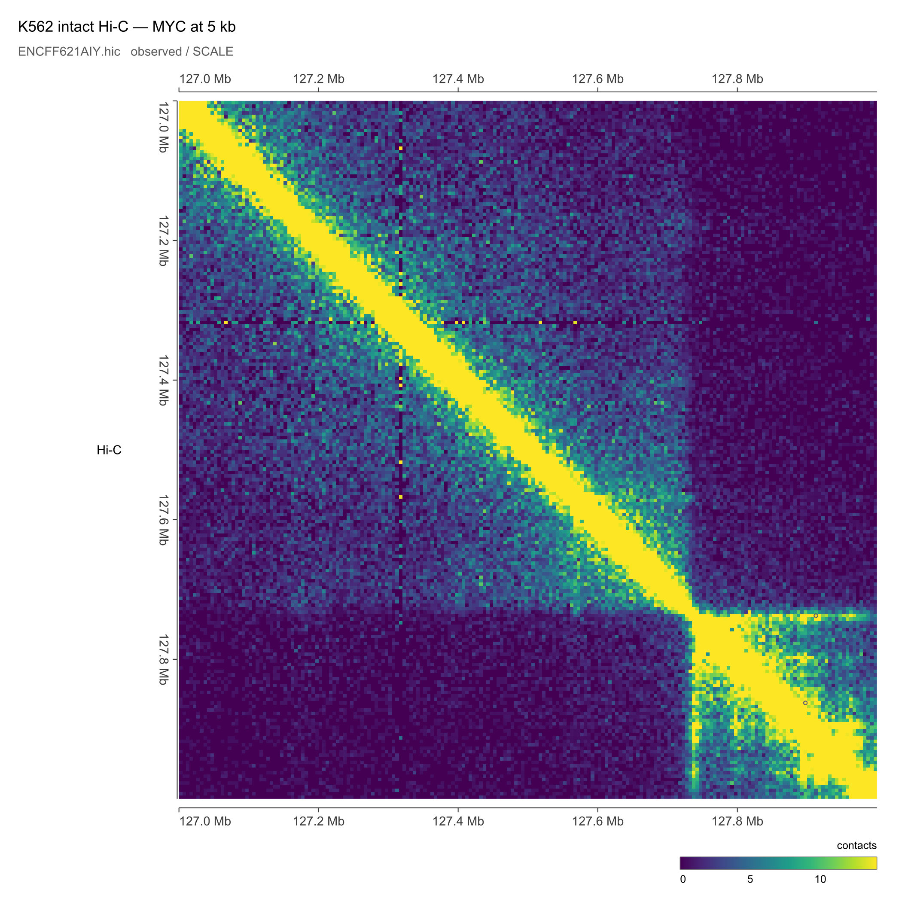
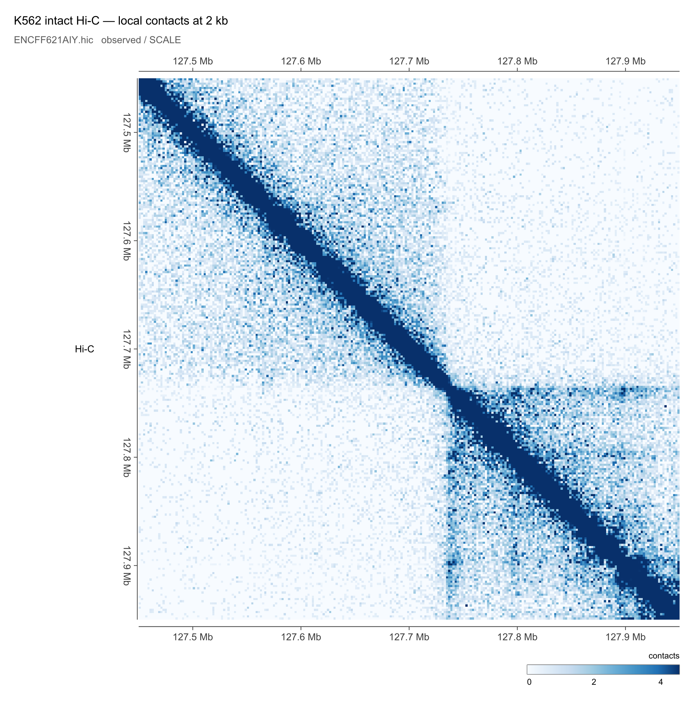
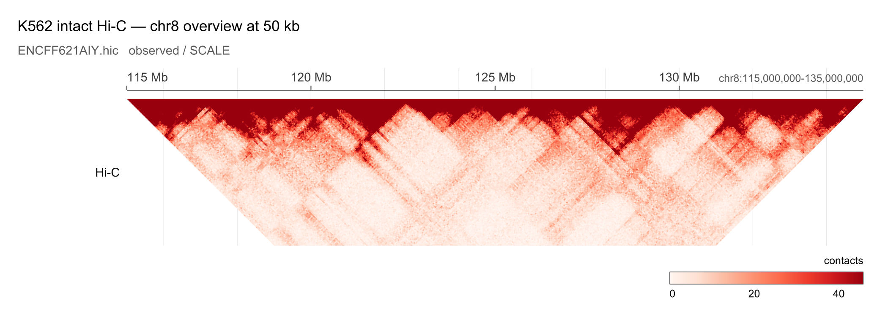

# GRE ENCODE gallery

These figures are generated entirely from released public ENCODE files. The
large `.hic` is queried in place with HTTP byte ranges; indexed bigWig and
bigBed files are also queried remotely. Compressed BEDPE and GTF files are
streamed directly and held in memory for the duration of a render.
No ENCODE input needs to be downloaded or checked into this repository.

The committed PNGs were generated at 300 DPI with linear contact scales:

```bash
./examples/gallery/generate.sh
```

Set `GRE_PLOT` to use a different executable or `OUT_DIR` to write elsewhere:

```bash
GRE_PLOT=/path/to/gre_plot OUT_DIR=/tmp/gre-gallery \
  ./examples/gallery/generate.sh
```

Remote rendering requires ordinary HTTPS access and servers that honor byte
range requests for `.hic`, bigWig, and bigBed. ENCODE satisfies those
requirements. Runtime depends mostly on network latency; the 33.8 GB `.hic`
is not transferred in full.

## Public inputs

All coordinates use GRCh38.

| accession | role | format | ENCODE record | direct URL |
|---|---|---|---|---|
| `ENCFF621AIY` | K562 mapQ30 contact matrix | hic | [record](https://www.encodeproject.org/files/ENCFF621AIY/) | [download/range source](https://www.encodeproject.org/files/ENCFF621AIY/@@download/ENCFF621AIY.hic) |
| `ENCFF725EXS` | K562 all-contact matrix from the same intact experiment | hic | [record](https://www.encodeproject.org/files/ENCFF725EXS/) | [download/range source](https://www.encodeproject.org/files/ENCFF725EXS/@@download/ENCFF725EXS.hic) |
| `ENCFF944MHS` | K562 5 kb compartment eigenvector | bigWig | [record](https://www.encodeproject.org/files/ENCFF944MHS/) | [download/range source](https://www.encodeproject.org/files/ENCFF944MHS/@@download/ENCFF944MHS.bigWig) |
| `ENCFF256ZMD` | K562 mapQ30 loops | BEDPE.gz | [record](https://www.encodeproject.org/files/ENCFF256ZMD/) | [stream source](https://www.encodeproject.org/files/ENCFF256ZMD/@@download/ENCFF256ZMD.bedpe.gz) |
| `ENCFF126GED` | K562 mapQ30 5 kb contact domains | BEDPE.gz | [record](https://www.encodeproject.org/files/ENCFF126GED/) | [stream source](https://www.encodeproject.org/files/ENCFF126GED/@@download/ENCFF126GED.bedpe.gz) |
| `ENCFF045OHM` | K562 replicated H3K27ac peaks | bigBed | [record](https://www.encodeproject.org/files/ENCFF045OHM/) | [download/range source](https://www.encodeproject.org/files/ENCFF045OHM/@@download/ENCFF045OHM.bigBed) |
| `ENCFF005MUK` | GENCODE v47 promoter reference | GTF.gz | [record](https://www.encodeproject.org/files/ENCFF005MUK/) | [stream source](https://www.encodeproject.org/files/ENCFF005MUK/@@download/ENCFF005MUK.gtf.gz) |
| `ENCFF094XCU` | K562 H3K27ac signal p-value | bigWig | [record](https://www.encodeproject.org/files/ENCFF094XCU/) | [download/range source](https://www.encodeproject.org/files/ENCFF094XCU/@@download/ENCFF094XCU.bigWig) |
| `ENCFF357GNC` | K562 ATAC-seq signal p-value | bigWig | [record](https://www.encodeproject.org/files/ENCFF357GNC/) | [download/range source](https://www.encodeproject.org/files/ENCFF357GNC/@@download/ENCFF357GNC.bigWig) |
| `ENCFF336UPT` | K562 CTCF ChIP-seq signal p-value | bigWig | [record](https://www.encodeproject.org/files/ENCFF336UPT/) | [download/range source](https://www.encodeproject.org/files/ENCFF336UPT/@@download/ENCFF336UPT.bigWig) |
| `ENCFF688NNQ` | K562 transcript models, GENCODE V29-based | GTF.gz | [record](https://www.encodeproject.org/files/ENCFF688NNQ/) | [stream source](https://www.encodeproject.org/files/ENCFF688NNQ/@@download/ENCFF688NNQ.gtf.gz) |

The Hi-C, compartment, loop, and domain files belong to released K562 intact
Hi-C experiment [ENCSR479XDG](https://www.encodeproject.org/experiments/ENCSR479XDG/).
The H3K27ac peaks belong to released K562 Histone ChIP-seq experiment
[ENCSR000AKP](https://www.encodeproject.org/experiments/ENCSR000AKP/).
The additional H3K27ac signal is from that experiment; ATAC-seq is from
[ENCSR868FGK](https://www.encodeproject.org/experiments/ENCSR868FGK/), CTCF
ChIP-seq is from
[ENCSR000EGM](https://www.encodeproject.org/experiments/ENCSR000EGM/), and the
K562 transcript models are from
[ENCSR589FUJ](https://www.encodeproject.org/experiments/ENCSR589FUJ/).

The commands below assume these shell variables, exactly as the generator
does:

```bash
HIC='https://www.encodeproject.org/files/ENCFF621AIY/@@download/ENCFF621AIY.hic'
HIC_ALL='https://www.encodeproject.org/files/ENCFF725EXS/@@download/ENCFF725EXS.hic'
COMPARTMENTS='https://www.encodeproject.org/files/ENCFF944MHS/@@download/ENCFF944MHS.bigWig'
LOOPS='https://www.encodeproject.org/files/ENCFF256ZMD/@@download/ENCFF256ZMD.bedpe.gz'
DOMAINS='https://www.encodeproject.org/files/ENCFF126GED/@@download/ENCFF126GED.bedpe.gz'
H3K27AC_PEAKS='https://www.encodeproject.org/files/ENCFF045OHM/@@download/ENCFF045OHM.bigBed'
PROMOTERS='https://www.encodeproject.org/files/ENCFF005MUK/@@download/ENCFF005MUK.gtf.gz'
H3K27AC_SIGNAL='https://www.encodeproject.org/files/ENCFF094XCU/@@download/ENCFF094XCU.bigWig'
ATAC_SIGNAL='https://www.encodeproject.org/files/ENCFF357GNC/@@download/ENCFF357GNC.bigWig'
CTCF_SIGNAL='https://www.encodeproject.org/files/ENCFF336UPT/@@download/ENCFF336UPT.bigWig'
TRANSCRIPTS='https://www.encodeproject.org/files/ENCFF688NNQ/@@download/ENCFF688NNQ.gtf.gz'
GRE_PLOT='./build/tools/gre_plot'
```

## 1. Pyramid plus supplied 1D and 2D annotations

This example combines a distance-limited triangular map with a signed
compartment signal, H3K27ac peak intervals, promoter annotations, supplied
contact domains, and a small set of supplied loops. Their markers use one
muted colour and a fixed small size so the contact map remains legible.

```bash
"$GRE_PLOT" "$HIC" chr8:126500000-130000000 \
  --layout pyramid --norm SCALE --resolution 25000 --max-distance 1200000 \
  --map-linear --map-colors fall --map-percentile 0.90 \
  --width 7 --dpi 300 --formats png --theme publication \
  --title 'K562 — MYC neighborhood' \
  "$COMPARTMENTS" --name 'A/B compartment' --height 28 --style area \
    --color '#B2182B' --neg-color '#2166AC' \
  "$H3K27AC_PEAKS" --type interval --name 'H3K27ac peaks' --height 24 \
    --color '#D95F02' --no-labels \
  "$PROMOTERS" --name 'GENCODE v47 promoters' --height 36 --no-labels \
  "$DOMAINS" --style domain --side above --color '#6D5A80' \
    --fill '#998EC320' \
  "$LOOPS" --style loop --side above --color '#4D5563' \
    --score-filter-min 50 --line-width 0.65 --score-size 0.55,0.55 \
  --out "examples/gallery/generated/01_pyramid_tracks"
```


## 2. Rich square map with both-axis signal and virtual 4C

The same compartment bigWig appears above and to the left of the square map.
A direct virtual 4C profile is extracted from the `.hic`, and its viewpoint is
marked by a translucent vertical band. Domains and small, uniform loop markers
are restricted to the upper triangle.

```bash
"$GRE_PLOT" "$HIC" chr8:126500000-130000000 \
  --layout square --norm SCALE --resolution 25000 --map-linear \
  --map-colors reds --map-percentile 0.90 \
  --width 7 --dpi 300 --formats png --theme publication \
  --title 'K562 — square map with 1D and 2D annotation' \
  "$COMPARTMENTS" --name 'PC1' --axis both --height 28 \
    --style area --color '#B2182B' --neg-color '#2166AC' \
  --virtual4c chr8:127700000-127750000 --name 'virtual 4C' --axis x \
    --style line --height 34 --color '#008837' --line-width 1.4 \
  "$DOMAINS" --style domain --side above --color '#6D5A80' \
    --fill '#998EC320' --line-width 0.75 \
  "$LOOPS" --style loop --side above --color '#59636F' \
    --score-filter-min 50 --line-width 0.6 --score-size 0.5,0.5 \
  --v-highlight chr8:127700000-127750000 \
    --highlight-color '#00A06020' --highlight-border '#008837' \
  --out "examples/gallery/generated/02_square_rich_annotations"
```


## 3. VS mode: mapQ30 above, all contacts below

Two contact matrices from the same intact Hi-C experiment show mapQ30 contacts
above the diagonal and all contacts below. Both halves use linear scales, with
separate colour maps and legends. Loop overlays are omitted to keep the
comparison focused on the matrices.

```bash
"$GRE_PLOT" "$HIC" chr8:126500000-130000000 \
  --layout square --norm SCALE --resolution 25000 \
  --map-colors reds --map-linear --map-percentile 0.90 \
  --vs "$HIC_ALL" --vs-norm SCALE --vs-side below \
    --vs-map-colors blues --vs-map-linear --vs-map-percentile 0.90 \
  --width 7 --dpi 300 --formats png --theme publication \
  --title 'K562 intact Hi-C — mapQ30 above, all contacts below' \
  --diagonal --out "examples/gallery/generated/03_intact_mapq30_vs_all"
```



## 4. Three square panels with one fitted contact scale

The vertically stacked square panels show different chromosomes and spans.
`--shared-map-scale` pools
their displayed finite contact values before fitting, so all three colour bars
resolve to the same limits and the same colour means the same contact count.
The compartment track is repeated after each `--panel` because annotations
are panel-scoped. Loop overlays are omitted here for a clearer comparison.

```bash
"$GRE_PLOT" "$HIC" chr8:126500000-130000000 \
  --layout square --norm SCALE --resolution 25000 \
  --shared-map-scale --panel-spacing 16 --map-linear \
  --map-colors magma --map-percentile 0.90 \
  --width 7 --dpi 300 --formats png --theme publication \
  --title 'K562 — three square maps on one shared contact scale' \
  --panel-title 'MYC neighborhood' \
  "$COMPARTMENTS" --name 'A/B compartment' --height 24 \
    --color '#B2182B' --neg-color '#2166AC' \
  --panel chr10:15500000-18300000 --panel-title 'chr10 loop-rich locus A' \
  "$COMPARTMENTS" --name 'A/B compartment' --height 24 \
    --color '#B2182B' --neg-color '#2166AC' \
  --panel chr10:50500000-52500000 --panel-title 'chr10 loop-rich locus B' \
  "$COMPARTMENTS" --name 'A/B compartment' --height 24 \
    --color '#B2182B' --neg-color '#2166AC' \
  --out "examples/gallery/generated/04_multi_panel_shared_scale"
```


## 5. Dark off-diagonal rectangle

Rectangle mode treats x and y as independent regions. This example displays a
block away from the main diagonal, overlays oriented loop boxes, and projects
separate supplied genomic intervals across x and y as cyan and yellow bands.

```bash
"$GRE_PLOT" "$HIC" chr8:126500000-128300000 \
  --layout rectangle --region-y chr8:128000000-130000000 \
  --norm SCALE --resolution 10000 --map-height 260 --map-linear \
  --map-colors magma --map-percentile 0.97 \
  --width 7 --dpi 300 --formats png --theme dark \
  --title 'K562 — off-diagonal contact block' \
  "$LOOPS" --style box --fill '#FFFFFF12' --color '#B4BFC9' \
    --score-filter-min 60 --line-width 0.6 --score-size 0.7,0.7 \
  --v-highlight chr8:127700000-127750000 \
    --highlight-color '#00E5FF20' --highlight-border '#00E5FF' \
  --h-highlight chr8:129650000-129725000 \
    --highlight-color '#FFEA0020' --highlight-border '#FFEA00' \
  --out "examples/gallery/generated/05_off_diagonal_rectangle"
```


## 6. Supplied loops as arcs, transcript models, and a blue map

The same ENCODE BEDPE loops can be represented as a separate one-dimensional
arc track instead of markers on the matrix. Arc endpoint positions come
directly from the supplied anchors; separation controls the base height, while
the BEDPE score filters weaker calls. Arcs use one colour and retain their
circular geometry. Longer arcs are painted first so short local loops remain
visible.

This example also demonstrates a true transcript-model row and two independent
quantitative assays. H3K27ac is an orange filled area, ATAC-seq is a teal line,
and the Hi-C matrix uses the sequential `blues` palette. Supplied domains remain
a dashed 2D overlay on the contact map.

```bash
"$GRE_PLOT" "$HIC" chr8:126500000-130000000 \
  --layout pyramid --norm SCALE --resolution 25000 --max-distance 700000 \
  --map-colors blues --map-linear --map-percentile 0.90 \
  --width 7 --label-width 110 --dpi 300 --formats png --theme publication \
  --title 'K562 — loops as arcs above a blue contact map' \
  "$TRANSCRIPTS" --name 'K562 transcript models' --height 70 \
    --row-height 13 --color '#1B7837' --no-labels \
  "$H3K27AC_SIGNAL" --name 'H3K27ac –log10(p)' --height 34 \
    --style area --color '#D95F0E' --percentile 0.995 \
  "$ATAC_SIGNAL" --name 'ATAC –log10(p)' --height 32 \
    --style line --color '#008B8B' --line-width 1.1 --percentile 0.995 \
  "$LOOPS" --style arc --name 'loops (observed)' --height 40 \
    --score-filter-min 60 --color '#753A8A' --line-width 1.2 \
    --fill '#7A017720' \
  "$DOMAINS" --style domain --side above --color '#4D4D4D' --dashed \
  --out "examples/gallery/generated/06_arc_loops_and_genes"
```


## 7. Tracks-only figure with area, bars, points, and intervals

GRE can compose 1D figures without drawing a contact matrix. This dark-theme
example uses `--no-map` and intentionally gives every layer a different visual
grammar: H3K27ac as an orange area with a proper y axis, ATAC-seq as turquoise
bars using maximum aggregation, CTCF as magenta points, scored H3K27ac peaks
with `viridis`, and GENCODE promoters as yellow intervals.

```bash
"$GRE_PLOT" "$HIC" chr8:127200000-128200000 \
  --no-map --norm SCALE --width 7 --label-width 110 --dpi 300 --formats png --theme dark \
  --title 'K562 — 1D track styles at MYC' \
  --subtitle 'area, bars, points, and scored intervals from public ENCODE URLs' \
  "$H3K27AC_SIGNAL" --name 'H3K27ac area' --height 46 \
    --style area --color '#FF9F1C' --percentile 0.995 --y-axis \
  "$ATAC_SIGNAL" --name 'ATAC bars' --height 44 \
    --style bars --color '#2EC4B6' --percentile 0.995 --aggregate max \
  "$CTCF_SIGNAL" --name 'CTCF points' --height 42 \
    --style points --color '#E056FD' --line-width 1.4 --percentile 0.995 \
  "$H3K27AC_PEAKS" --type interval --name 'H3K27ac peaks' --height 24 \
    --colormap viridis --no-labels \
  "$PROMOTERS" --type interval --name 'GENCODE promoters' --height 24 \
    --color '#F4D35E' --no-labels \
  --out "examples/gallery/generated/07_one_dimensional_tracks"
```


## 8. Local 5 kb map in viridis

A 1 Mb square view resolves local contacts from the intact mapQ30 matrix at 5 kb.
The loop calls come from the same intact Hi-C experiment.

```bash
"$GRE_PLOT" "$HIC" chr8:127000000-128000000 \
  --layout square --norm SCALE --resolution 5000 \
  --map-linear --map-colors viridis --map-percentile 0.93 \
  --width 7 --dpi 300 --formats png --theme publication \
  --title 'K562 intact Hi-C — MYC at 5 kb' \
  "$LOOPS" --style loop --side above --color '#59636F' \
    --score-filter-min 50 --line-width 0.6 --score-size 0.5,0.5 \
  --out "examples/gallery/generated/08_intact_5kb_viridis"
```



## 9. Local 2 kb map in blues

A tighter 500 kb region shows the native 2 kb matrix bins with a linear blue scale.

```bash
"$GRE_PLOT" "$HIC" chr8:127450000-127950000 \
  --layout square --norm SCALE --resolution 2000 \
  --map-linear --map-colors blues --map-percentile 0.93 \
  --width 7 --dpi 300 --formats png --theme publication \
  --title 'K562 intact Hi-C — local contacts at 2 kb' \
  --out "examples/gallery/generated/09_intact_2kb_blues"
```



## 10. Broad 50 kb map in reds

The 20 Mb chr8 view uses 50 kb bins to show larger scale contact structure.

```bash
"$GRE_PLOT" "$HIC" chr8:115000000-135000000 \
  --layout pyramid --norm SCALE --resolution 50000 --max-distance 8000000 \
  --map-linear --map-colors reds --map-percentile 0.90 \
  --width 7 --dpi 300 --formats png --theme publication \
  --title 'K562 intact Hi-C — chr8 overview at 50 kb' \
  --out "examples/gallery/generated/10_intact_50kb_reds"
```



## Reproducibility notes

- These examples use the file's resolution-specific `SCALE` vectors. This
  version-9 `.hic` advertises only `NONE` in its top-level metadata, but a
  direct `SCALE` query succeeded at 2 kb. Normalization availability can be
  resolution-specific, so test other requested resolutions with the file.
- URLs are quoted because `@` and other URL characters should reach GRE
  unchanged. The ENCODE URLs shown here do not currently contain shell `&`
  characters, but quoting remains the safe default.
- HTTP errors, range-request failures, or portal maintenance can interrupt a
  remote render. Re-running the script is safe; each output PNG is replaced
  only after its command completes successfully.
- The 44.9 MB transcript GTF used by example 6 is streamed because GTF is not
  indexed for genomic range requests. The `.hic` and bigWig/bigBed inputs are
  range-queried and are not downloaded in full.
- BEDPE column 8 is empty in these Juicer outputs. GRE recognizes the common
  ENCODE/Juicer layout and uses the quantitative column after itemRgb (column
  12: observed loop count or domain score) as a fallback score.
- The PNGs are committed so the README remains viewable when offline. Rebuild
  them when renderer defaults, data adapters, or gallery commands change.
